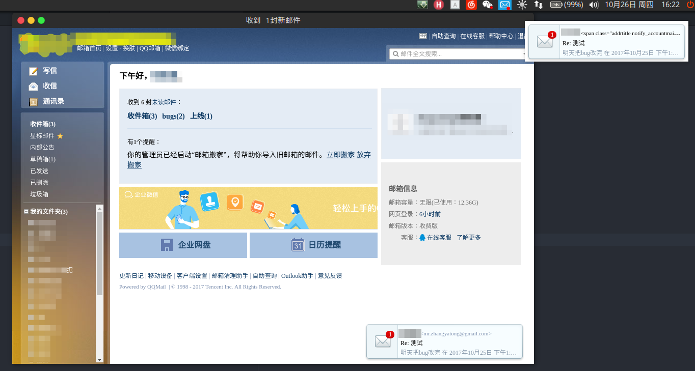

# qqmail-client
qq企业邮箱的桌面版客户端
***
## 功能

> + 新邮件推送提醒
> + 未读邮件标记

## 安装
```Bash
    # Clone this repository
    git clone https://github.com/qq181958825/electronic-qqmail
    # Go into the repository
    cd electronic-qqmail
    # Install dependencies
    npm install
    # Run the app
    npm start
```
## 支持
cczzbbdd@qq.com

## 版本
### v0.1.3(coding)
+ 添加个人邮箱的支持

### v0.1.2
+ 添加esc隐藏
+ 添加全局快捷键

### v0.1.1
+ 添加推送
  - 可以点击后打开邮件

### v0.1
+ 基本功能实现
  - 可以显示tray红点
